# On-Call Rotation Platform

A multi-team on-call scheduling platform built with **Java Spring Boot** (backend) and **Angular** (frontend).
Only `@agilysys.com` email addresses are permitted across the entire system.

---

## Table of Contents

1. [System Overview](#1-system-overview)
2. [Authentication & Access Control](#2-authentication--access-control)
3. [Member Onboarding](#3-member-onboarding)
4. [Team & Policy Setup](#4-team--policy-setup)
5. [Schedule Generation](#5-schedule-generation)
6. [On-Call Session Lifecycle](#6-on-call-session-lifecycle)
7. [Daily Work Log — Clock In / Pause / Resume / Clock Out](#7-daily-work-log--clock-in--pause--resume--clock-out)
8. [Azure DevOps Ticket Link & Unlink](#8-azure-devops-ticket-link--unlink)
9. [Handover Workflow](#9-handover-workflow)
10. [Leave Request Flow](#10-leave-request-flow)
11. [Emergency OOO Flow](#11-emergency-ooo-flow)
12. [Mid-Week Reassignment Flow](#12-mid-week-reassignment-flow)
13. [Swap Request Flow](#13-swap-request-flow)
14. [Manager Approval Inbox & Delegation](#14-manager-approval-inbox--delegation)
15. [Holiday Impact Flow](#15-holiday-impact-flow)
16. [Notification & Reminder Flow](#16-notification--reminder-flow)
17. [Audit Log Flow](#17-audit-log-flow)
18. [Reporting Flow](#18-reporting-flow)
19. [Entity Relationship Overview](#19-entity-relationship-overview)
20. [Environment & Configuration](#20-environment--configuration)

---

## 1. System Overview

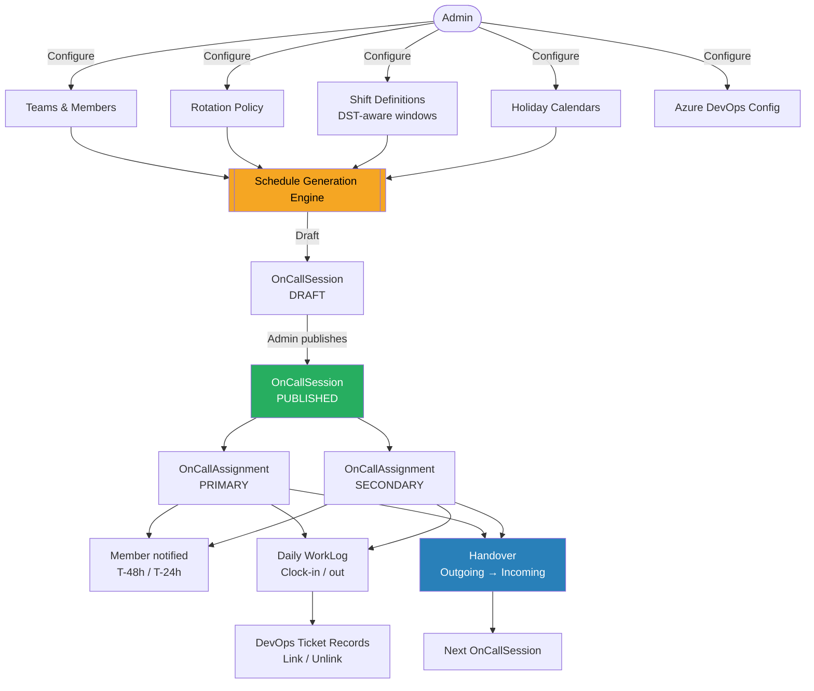
```mermaid
flowchart TD
    A([Admin]) -->|Configure| B[Teams & Members]
    A -->|Configure| C[Rotation Policy]
    A -->|Configure| D[Shift Definitions\nDST-aware windows]
    A -->|Configure| E[Holiday Calendars]
    A -->|Configure| F[Azure DevOps Config]

    B & C & D & E --> G[[Schedule Generation Engine]]
    G -->|Draft| H[OnCallSession\nDRAFT]
    H -->|Admin publishes| I[OnCallSession\nPUBLISHED]

    I --> J[OnCallAssignment\nPRIMARY]
    I --> K[OnCallAssignment\nSECONDARY]

    J & K --> L[Member notified\nT-48h / T-24h]
    J & K --> M[Daily WorkLog\nClock-in / out]
    M --> N[DevOps Ticket Records\nLink / Unlink]
    J & K --> O[Handover\nOutgoing → Incoming]
    O --> P[Next OnCallSession]

    style G fill:#f5a623,color:#000
    style I fill:#27ae60,color:#fff
    style O fill:#2980b9,color:#fff
```

---

## 2. Authentication & Access Control

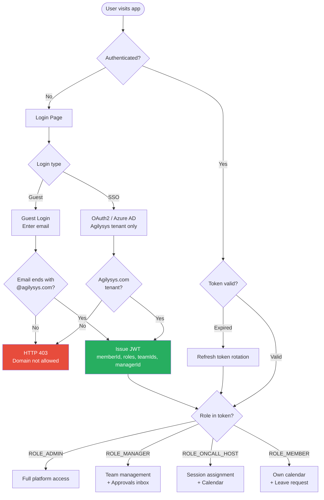
```mermaid
flowchart TD
    Start([User visits app]) --> AuthCheck{Authenticated?}
    AuthCheck -- No --> LoginPage[Login Page]
    LoginPage --> GuestOrSSO{Login type}

    GuestOrSSO -- SSO --> SSOProvider[OAuth2 / Azure AD\nAgilysys tenant only]
    GuestOrSSO -- Guest --> GuestForm[Guest Login\nEnter email]

    GuestForm --> DomainCheck{Email ends with\n@agilysys.com?}
    DomainCheck -- No --> Reject403[HTTP 403\nDomain not allowed]
    DomainCheck -- Yes --> IssueToken

    SSOProvider --> TenantCheck{Agilysys.com\ntenant?}
    TenantCheck -- No --> Reject403
    TenantCheck -- Yes --> IssueToken

    IssueToken[Issue JWT\nmemberId, roles, teamIds, managerId] --> RoleRouter

    RoleRouter{Role in token?}
    RoleRouter -- ROLE_ADMIN --> AdminDashboard[Full platform access]
    RoleRouter -- ROLE_MANAGER --> ManagerDashboard[Team management\n+ Approvals inbox]
    RoleRouter -- ROLE_ONCALL_HOST --> HostDashboard[Session assignment\n+ Calendar]
    RoleRouter -- ROLE_MEMBER --> MemberDashboard[Own calendar\n+ Leave request]

    AuthCheck -- Yes --> TokenRefresh{Token valid?}
    TokenRefresh -- Expired --> RefreshFlow[Refresh token rotation]
    RefreshFlow --> RoleRouter
    TokenRefresh -- Valid --> RoleRouter

    style Reject403 fill:#e74c3c,color:#fff
    style IssueToken fill:#27ae60,color:#fff
```

---

## 3. Member Onboarding

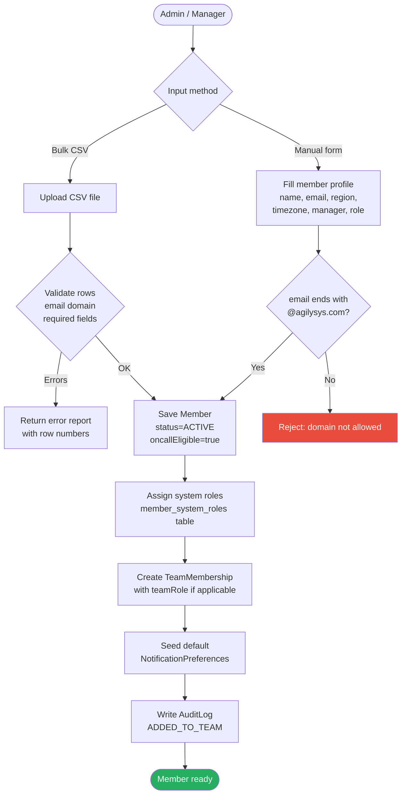
```mermaid
flowchart TD
    Admin([Admin / Manager]) --> Method{Input method}
    Method -- Manual form --> Form[Fill member profile\nname, email, region,\ntimezone, manager, role]
    Method -- Bulk CSV --> CSV[Upload CSV file]

    CSV --> Validate{Validate rows\nemail domain\nrequired fields}
    Validate -- Errors --> ErrorReport[Return error report\nwith row numbers]
    Validate -- OK --> Persist

    Form --> EmailCheck{email ends with\n@agilysys.com?}
    EmailCheck -- No --> ValidationError[Reject: domain not allowed]
    EmailCheck -- Yes --> Persist

    Persist[Save Member\nstatus=ACTIVE\noncallEligible=true] --> AssignRoles[Assign system roles\nmember_system_roles table]
    AssignRoles --> AddToTeam[Create TeamMembership\nwith teamRole if applicable]
    AddToTeam --> SetNotifPrefs[Seed default\nNotificationPreferences]
    SetNotifPrefs --> AuditEntry[Write AuditLog\nADDED_TO_TEAM]
    AuditEntry --> Done([Member ready])

    style ValidationError fill:#e74c3c,color:#fff
    style Done fill:#27ae60,color:#fff
```

---

## 4. Team & Policy Setup

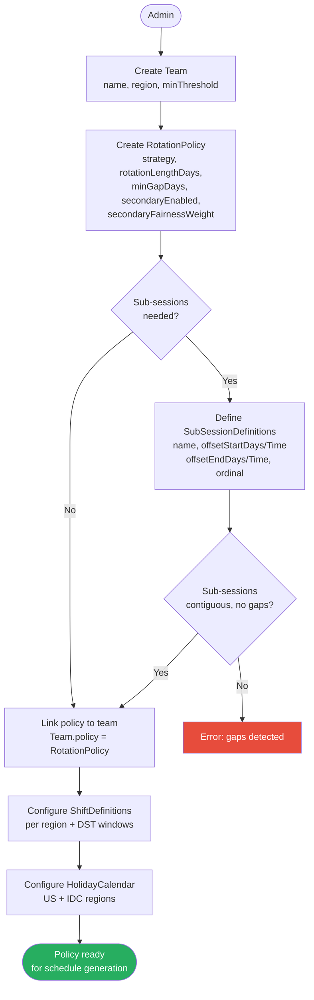
```mermaid
flowchart TD
    Admin([Admin]) --> CreateTeam[Create Team\nname, region, minThreshold]
    CreateTeam --> CreatePolicy[Create RotationPolicy\nstrategy, rotationLengthDays,\nminGapDays, secondaryEnabled,\nsecondaryFairnessWeight]
    CreatePolicy --> SubSessions{Sub-sessions\nneeded?}
    SubSessions -- Yes --> DefineSubSessions[Define SubSessionDefinitions\nname, offsetStartDays/Time\noffsetEndDays/Time, ordinal]
    SubSessions -- No --> LinkPolicy
    DefineSubSessions --> ValidateContiguous{Sub-sessions\ncontiguous, no gaps?}
    ValidateContiguous -- No --> SubSessionError[Error: gaps detected]
    ValidateContiguous -- Yes --> LinkPolicy

    LinkPolicy[Link policy to team\nTeam.policy = RotationPolicy]
    LinkPolicy --> DefineShifts[Configure ShiftDefinitions\nper region + DST windows]
    DefineShifts --> ConfigHolidays[Configure HolidayCalendar\nUS + IDC regions]
    ConfigHolidays --> PolicyReady([Policy ready\nfor schedule generation])

    style SubSessionError fill:#e74c3c,color:#fff
    style PolicyReady fill:#27ae60,color:#fff
```

---

## 5. Schedule Generation


```mermaid
flowchart TD
    Trigger([Admin / OncallHost\ntriggers generation]) --> LoadPolicy[Load RotationPolicy\n+ SubSessionDefinitions\n+ ShiftDefinitions]
    LoadPolicy --> LoadMembers[Load eligible members\neligibilityFlag=true\nno approved leave covering week]
    LoadMembers --> LoopWeeks[For each week in horizon]

    LoopWeeks --> LoopSessions{Sub-sessions\ndefined?}
    LoopSessions -- Yes --> ForEachSub[For each SubSession\nin ordinal order]
    LoopSessions -- No --> FullWeek[Use full week as one session]

    ForEachSub --> AllocPrimary
    FullWeek --> AllocPrimary

    AllocPrimary[Apply allocation strategy\nRoundRobin / LeastRecentlyAssigned\n/ WeightedFairness\nto select PRIMARY] --> GapCheck{Primary meets\nminGapDays?}
    GapCheck -- No --> Relax{Constraint\nrelaxation?}
    Relax -- Warn admin --> AdminApproval{Admin approves\nrelaxation?}
    AdminApproval -- No --> BlockGeneration[Block: unresolvable]
    AdminApproval -- Yes --> AllocPrimary2[Assign nearest-eligible\nPRIMARY with audit note]
    GapCheck -- Yes --> AllocSecondary

    AllocPrimary2 --> AllocSecondary
    AllocSecondary[Select SECONDARY\nfrom eligible pool\napply secondaryFairnessWeight] --> SamePersonCheck{Primary = Secondary?}
    SamePersonCheck -- Yes --> RetrySecondary[Pick next candidate]
    RetrySecondary --> SamePersonCheck
    SamePersonCheck -- No --> SameTeamCheck{Same team\ndisallowed by policy?}
    SameTeamCheck -- Yes --> RetrySecondary
    SameTeamCheck -- No --> HolidayCheck

    HolidayCheck{Week overlaps\nholiday?} -- Yes --> FlagHoliday[Flag for admin review\nHolidayShiftImpact rule]
    HolidayCheck -- No --> CreateDraft

    FlagHoliday --> CreateDraft
    CreateDraft[Create OnCallSession DRAFT\nCreate OnCallAssignment\nPRIMARY + SECONDARY\nfairnessCreditDays computed]
    CreateDraft --> MoreWeeks{More weeks\nin horizon?}
    MoreWeeks -- Yes --> LoopWeeks
    MoreWeeks -- No --> DraftReady

    DraftReady[Schedule draft ready\nfor admin review] --> AdminPublish{Admin reviews\nand publishes?}
    AdminPublish -- Reject --> RegenerateOrAdjust[Adjust and regenerate]
    AdminPublish -- Publish --> PublishSessions[Set all sessions\nto PUBLISHED\nWrite AuditLog]
    PublishSessions --> NotifyAssignees[Send ASSIGNED_PRIMARY\n/ ASSIGNED_SECONDARY\nnotifications]
    NotifyAssignees --> ScheduleReminders[Queue T-48h and T-24h\nreminder notifications]
    ScheduleReminders --> Done([Schedule live])

    style BlockGeneration fill:#e74c3c,color:#fff
    style Done fill:#27ae60,color:#fff
    style DraftReady fill:#f5a623,color:#000
```

---

## 6. On-Call Session Lifecycle

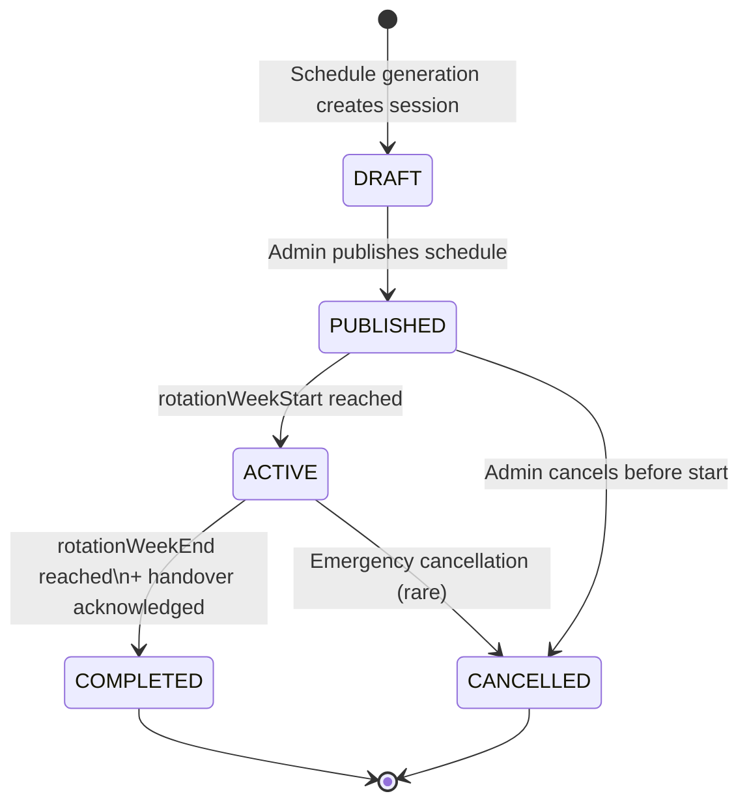
```mermaid
stateDiagram-v2
    [*] --> DRAFT: Schedule generation creates session
    DRAFT --> PUBLISHED: Admin publishes schedule
    PUBLISHED --> ACTIVE: rotationWeekStart reached
    ACTIVE --> COMPLETED: rotationWeekEnd reached\n+ handover acknowledged
    PUBLISHED --> CANCELLED: Admin cancels before start
    ACTIVE --> CANCELLED: Emergency cancellation (rare)
    COMPLETED --> [*]
    CANCELLED --> [*]
```

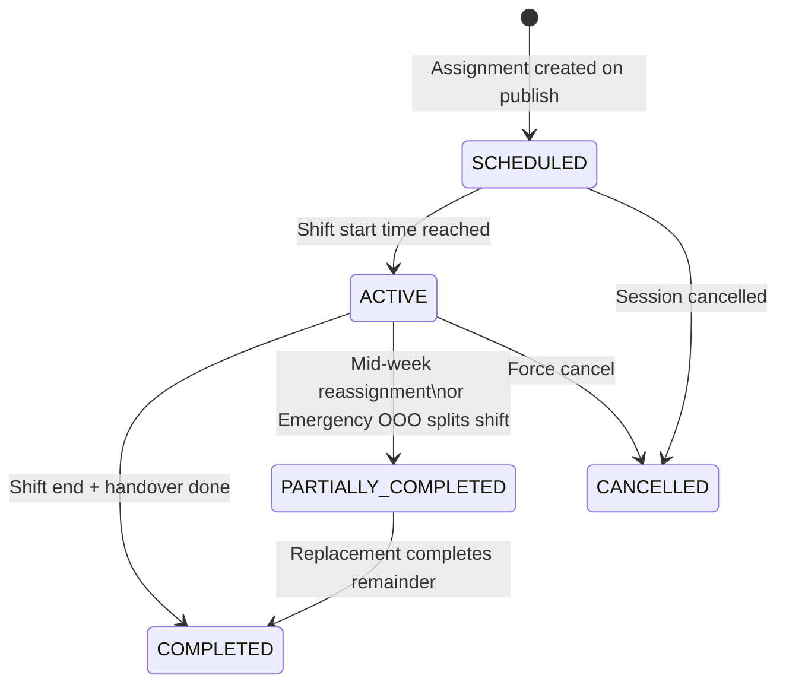
```mermaid
stateDiagram-v2
    [*] --> SCHEDULED: Assignment created on publish
    SCHEDULED --> ACTIVE: Shift start time reached
    ACTIVE --> COMPLETED: Shift end + handover done
    ACTIVE --> PARTIALLY_COMPLETED: Mid-week reassignment\nor Emergency OOO splits shift
    PARTIALLY_COMPLETED --> COMPLETED: Replacement completes remainder
    SCHEDULED --> CANCELLED: Session cancelled
    ACTIVE --> CANCELLED: Force cancel
```

---

## 7. Daily Work Log — Clock In / Pause / Resume / Clock Out

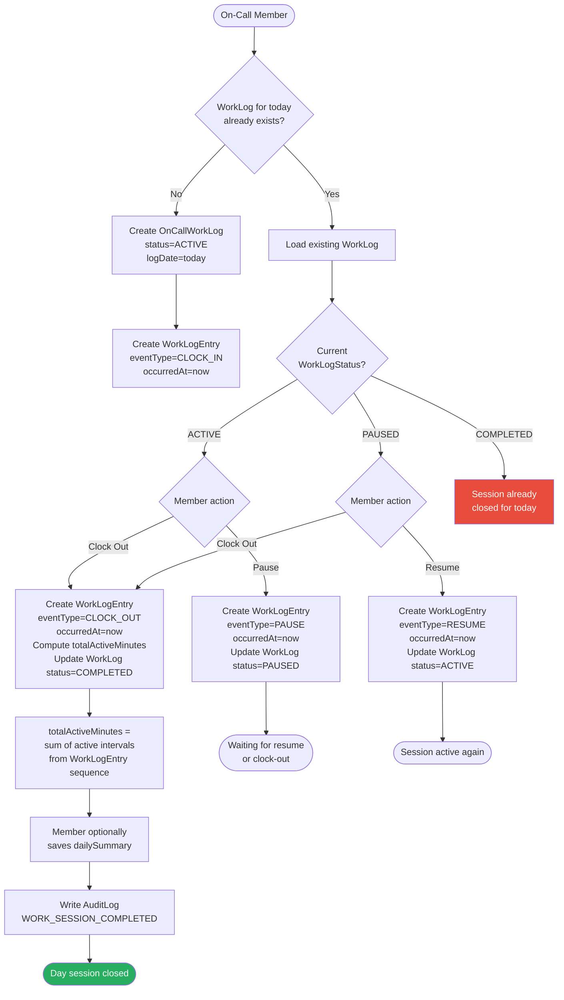
```mermaid
flowchart TD
    Member([On-Call Member]) --> CheckLog{WorkLog for today\nalready exists?}
    CheckLog -- No --> CreateLog[Create OnCallWorkLog\nstatus=ACTIVE\nlogDate=today]
    CheckLog -- Yes --> ExistingLog[Load existing WorkLog]

    CreateLog --> ClockIn
    ExistingLog --> StateCheck{Current\nWorkLogStatus?}
    StateCheck -- ACTIVE --> Actions1{Member action}
    StateCheck -- PAUSED --> Actions2{Member action}
    StateCheck -- COMPLETED --> AlreadyStopped[Session already\nclosed for today]

    Actions1 -- Pause --> PauseEvent[Create WorkLogEntry\neventType=PAUSE\noccurredAt=now\nUpdate WorkLog status=PAUSED]
    Actions1 -- Clock Out --> ClockOutEvent[Create WorkLogEntry\neventType=CLOCK_OUT\noccurredAt=now\nCompute totalActiveMinutes\nUpdate WorkLog status=COMPLETED]

    Actions2 -- Resume --> ResumeEvent[Create WorkLogEntry\neventType=RESUME\noccurredAt=now\nUpdate WorkLog status=ACTIVE]
    Actions2 -- Clock Out --> ClockOutEvent

    ClockIn[Create WorkLogEntry\neventType=CLOCK_IN\noccurredAt=now]

    ClockOutEvent --> CalcTime[totalActiveMinutes =\nsum of active intervals\nfrom WorkLogEntry sequence]
    CalcTime --> SaveSummary[Member optionally\nsaves dailySummary]
    SaveSummary --> AuditEntry[Write AuditLog\nWORK_SESSION_COMPLETED]

    PauseEvent --> WaitResume([Waiting for resume\nor clock-out])
    ResumeEvent --> ActiveAgain([Session active again])
    AuditEntry --> SessionDone([Day session closed])

    style AlreadyStopped fill:#e74c3c,color:#fff
    style SessionDone fill:#27ae60,color:#fff
```

---

## 8. Azure DevOps Ticket Link & Unlink

```mermaid
flowchart TD
    Member([On-Call Member]) --> ActiveWorkLog{Active WorkLog\nexists today?}
    ActiveWorkLog -- No --> NoLog[Must clock in first]
    ActiveWorkLog -- Yes --> LinkMethod{How to find\nticket?}

    LinkMethod -- Manual ID entry --> ManualID[Enter ADO work item ID]
    LinkMethod -- ADO query --> WIQLQuery[Select saved WIQL query\nfrom shared queries list]
    LinkMethod -- ADO lookup --> DirectLookup[Search by ID via\nPOST /_apis/wit/workitemsbatch]

    ManualID --> FetchTicket
    WIQLQuery --> RunWIQL[POST /{project}/_apis/wit/wiql\nreturns list of work item IDs]
    RunWIQL --> BatchFetch[POST /_apis/wit/workitemsbatch\nmax 200 IDs per batch]
    DirectLookup --> FetchTicket

    BatchFetch --> SelectTicket[Member selects ticket\nfrom results list]
    SelectTicket --> FetchTicket

    FetchTicket[Fetch work item fields\nSystem.Id, Title, State,\nWorkItemType, AssignedTo,\nPriority, Severity, Tags,\nAreaPath, IterationPath,\nDescription, Dates] --> CreateRecord[Create DevOpsTicketRecord\nunlinkedAt=null\nlinkSource=ADO_LOOKUP/ADO_QUERY/MANUAL]
    CreateRecord --> SetTime[Member sets timeSpentMinutes\nand optional notes]
    SetTime --> SaveRecord[Persist record\nlinked to WorkLog + Assignment]
    SaveRecord --> AuditLink[Write AuditLog\nTICKET_LINKED]

    SaveRecord --> UnlinkAction{Member / Manager\nwants to unlink?}
    UnlinkAction -- Yes --> SoftDelete[Set unlinkedAt=now\nSet unlinkedBy=actor]
    SoftDelete --> AuditUnlink[Write AuditLog\nTICKET_UNLINKED]
    AuditUnlink --> RecordRetained[Record retained\nin history\nfiltered from active view]
    UnlinkAction -- No --> TicketVisible([Ticket visible in\nactive work session])

    style NoLog fill:#e74c3c,color:#fff
    style TicketVisible fill:#27ae60,color:#fff
    style RecordRetained fill:#f5a623,color:#000
```

---

## 9. Handover Workflow

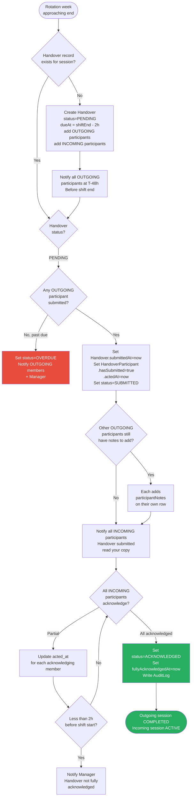
```mermaid
flowchart TD
    SessionEnd([Rotation week\napproaching end]) --> HandoverExists{Handover record\nexists for session?}
    HandoverExists -- No --> CreateHandover[Create Handover\nstatus=PENDING\ndueAt = shiftEnd - 2h\nadd OUTGOING participants\nadd INCOMING participants]
    HandoverExists -- Yes --> CheckStatus

    CreateHandover --> Notify48h[Notify all OUTGOING\nparticipants at T-48h\nBefore shift end]
    Notify48h --> CheckStatus{Handover\nstatus?}

    CheckStatus -- PENDING --> OutgoingSubmit{Any OUTGOING\nparticipant\nsubmitted?}
    OutgoingSubmit -- No, past due --> OverdueAlert[Set status=OVERDUE\nNotify OUTGOING members\n+ Manager]
    OutgoingSubmit -- Yes --> FirstSubmit[Set Handover.submittedAt=now\nSet HandoverParticipant\n.hasSubmitted=true\n.actedAt=now\nSet status=SUBMITTED]

    FirstSubmit --> MoreOutgoing{Other OUTGOING\nparticipants still\nhave notes to add?}
    MoreOutgoing -- Yes --> AdditionalNotes[Each adds\nparticipantNotes\non their own row]
    MoreOutgoing -- No --> NotifyIncoming

    AdditionalNotes --> NotifyIncoming
    NotifyIncoming[Notify all INCOMING participants\nHandover submitted\nread your copy]

    NotifyIncoming --> IncomingAck{All INCOMING\nparticipants\nacknowledge?}
    IncomingAck -- Partial --> PartialAck[Update acted_at\nfor each acknowledging member]
    PartialAck --> Reminder2h{Less than 2h\nbefore shift start?}
    Reminder2h -- Yes --> EscalateManager[Notify Manager\nHandover not fully\nacknowledged]
    Reminder2h -- No --> IncomingAck

    IncomingAck -- All acknowledged --> FullyAcknowledged[Set status=ACKNOWLEDGED\nSet fullyAcknowledgedAt=now\nWrite AuditLog]
    FullyAcknowledged --> SessionTransition([Outgoing session COMPLETED\nIncoming session ACTIVE])

    style OverdueAlert fill:#e74c3c,color:#fff
    style SessionTransition fill:#27ae60,color:#fff
    style FullyAcknowledged fill:#27ae60,color:#fff
```

---

## 10. Leave Request Flow

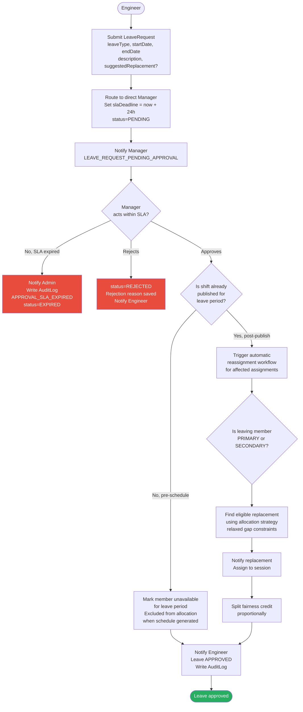
```mermaid
flowchart TD
    Engineer([Engineer]) --> SubmitLeave[Submit LeaveRequest\nleaveType, startDate, endDate\ndescription, suggestedReplacement?]
    SubmitLeave --> RouteToManager[Route to direct Manager\nSet slaDeadline = now + 24h\nstatus=PENDING]
    RouteToManager --> NotifyManager[Notify Manager\nLEAVE_REQUEST_PENDING_APPROVAL]

    NotifyManager --> ManagerActs{Manager\nacts within SLA?}
    ManagerActs -- No, SLA expired --> Escalate[Notify Admin\nWrite AuditLog\nAPPROVAL_SLA_EXPIRED\nstatus=EXPIRED]
    ManagerActs -- Rejects --> Rejected[status=REJECTED\nRejection reason saved\nNotify Engineer]
    ManagerActs -- Approves --> CheckSchedule{Is shift already\npublished for\nleave period?}

    CheckSchedule -- No, pre-schedule --> MarkUnavailable[Mark member unavailable\nfor leave period\nExcluded from allocation\nwhen schedule generated]
    CheckSchedule -- Yes, post-publish --> TriggerReassign[Trigger automatic\nreassignment workflow\nfor affected assignments]

    TriggerReassign --> ReassignPrimary{Is leaving member\nPRIMARY or SECONDARY?}
    ReassignPrimary --> FindReplacement[Find eligible replacement\nusing allocation strategy\nrelaxed gap constraints]
    FindReplacement --> NotifyReplacement[Notify replacement\nAssign to session]
    NotifyReplacement --> SplitCredit[Split fairness credit\nproportionally]

    MarkUnavailable --> NotifyEngineer
    SplitCredit --> NotifyEngineer[Notify Engineer\nLeave APPROVED\nWrite AuditLog]
    NotifyEngineer --> Done([Leave approved])

    style Escalate fill:#e74c3c,color:#fff
    style Rejected fill:#e74c3c,color:#fff
    style Done fill:#27ae60,color:#fff
```

---

## 11. Emergency OOO Flow

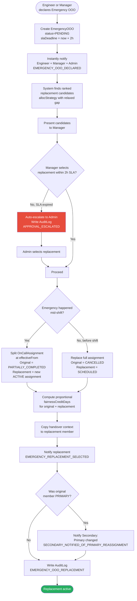
```mermaid
flowchart TD
    Trigger([Engineer or Manager\ndeclares Emergency OOO]) --> CreateOOO[Create EmergencyOOO\nstatus=PENDING\nslaDeadline = now + 2h]
    CreateOOO --> NotifyAll[Instantly notify\nEngineer + Manager + Admin\nEMERGENCY_OOO_DECLARED]

    NotifyAll --> FindCandidates[System finds ranked\nreplacement candidates\nallocStrategy with relaxed gap]
    FindCandidates --> PresentCandidates[Present candidates\nto Manager]

    PresentCandidates --> ManagerSelect{Manager selects\nreplacement within 2h SLA?}
    ManagerSelect -- No, SLA expired --> AutoEscalate[Auto-escalate to Admin\nWrite AuditLog\nAPPROVAL_ESCALATED]
    AutoEscalate --> AdminSelects[Admin selects replacement]
    AdminSelects --> Proceed

    ManagerSelect -- Yes --> Proceed

    Proceed --> MidShift{Emergency happened\nmid-shift?}
    MidShift -- Yes --> SplitShift[Split OnCallAssignment\nat effectiveFrom\nOriginal = PARTIALLY_COMPLETED\nReplacement = new ACTIVE assignment]
    MidShift -- No, before shift --> ReplaceWhole[Replace full assignment\nOriginal = CANCELLED\nReplacement = SCHEDULED]

    SplitShift --> CreditCalc[Compute proportional\nfairnessCreditDays\nfor original + replacement]
    ReplaceWhole --> CreditCalc

    CreditCalc --> CarryHandover[Copy handover context\nto replacement member]
    CarryHandover --> NotifyReplacement[Notify replacement\nEMERGENCY_REPLACEMENT_SELECTED]
    NotifyReplacement --> CheckRole{Was original\nmember PRIMARY?}
    CheckRole -- Yes --> NotifySecondary[Notify Secondary:\nPrimary changed\nSECONDARY_NOTIFIED_OF_PRIMARY_REASSIGNMENT]
    CheckRole -- No --> WriteAudit
    NotifySecondary --> WriteAudit

    WriteAudit[Write AuditLog\nEMERGENCY_OOO_REPLACEMENT] --> Done([Replacement active])

    style AutoEscalate fill:#e74c3c,color:#fff
    style Done fill:#27ae60,color:#fff
```

---

## 12. Mid-Week Reassignment Flow

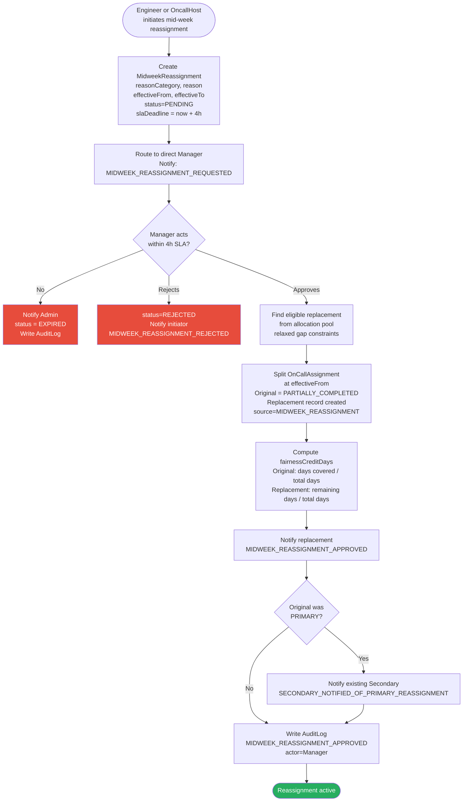
```mermaid
flowchart TD
    Initiator([Engineer or OncallHost\ninitiates mid-week reassignment]) --> CreateReq[Create MidweekReassignment\nreasonCategory, reason\neffectiveFrom, effectiveTo\nstatus=PENDING\nslaDeadline = now + 4h]
    CreateReq --> RouteManager[Route to direct Manager\nNotify: MIDWEEK_REASSIGNMENT_REQUESTED]

    RouteManager --> ManagerActs{Manager acts\nwithin 4h SLA?}
    ManagerActs -- No --> Escalate[Notify Admin\nstatus = EXPIRED\nWrite AuditLog]
    ManagerActs -- Rejects --> Rejected[status=REJECTED\nNotify initiator\nMIDWEEK_REASSIGNMENT_REJECTED]
    ManagerActs -- Approves --> FindReplacement[Find eligible replacement\nfrom allocation pool\nrelaxed gap constraints]

    FindReplacement --> SplitAssignment[Split OnCallAssignment\nat effectiveFrom\nOriginal = PARTIALLY_COMPLETED\nReplacement record created\nsource=MIDWEEK_REASSIGNMENT]
    SplitAssignment --> ProportionalCredit[Compute fairnessCreditDays\nOriginal: days covered / total days\nReplacement: remaining days / total days]
    ProportionalCredit --> NotifyReplacement[Notify replacement\nMIDWEEK_REASSIGNMENT_APPROVED]
    NotifyReplacement --> CheckRole{Original was\nPRIMARY?}
    CheckRole -- Yes --> NotifySecondary[Notify existing Secondary\nSECONDARY_NOTIFIED_OF_PRIMARY_REASSIGNMENT]
    CheckRole -- No --> WriteAudit
    NotifySecondary --> WriteAudit

    WriteAudit[Write AuditLog\nMIDWEEK_REASSIGNMENT_APPROVED\nactor=Manager] --> Done([Reassignment active])

    style Escalate fill:#e74c3c,color:#fff
    style Rejected fill:#e74c3c,color:#fff
    style Done fill:#27ae60,color:#fff
```

---

## 13. Swap Request Flow

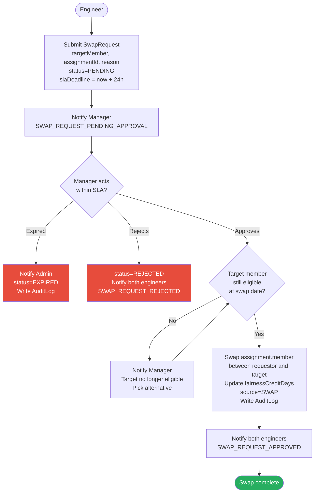
```mermaid
flowchart TD
    Engineer([Engineer]) --> SubmitSwap[Submit SwapRequest\ntargetMember, assignmentId, reason\nstatus=PENDING\nslaDeadline = now + 24h]
    SubmitSwap --> NotifyManager[Notify Manager\nSWAP_REQUEST_PENDING_APPROVAL]

    NotifyManager --> ManagerActs{Manager acts\nwithin SLA?}
    ManagerActs -- Expired --> Escalate[Notify Admin\nstatus=EXPIRED\nWrite AuditLog]
    ManagerActs -- Rejects --> Rejected[status=REJECTED\nNotify both engineers\nSWAP_REQUEST_REJECTED]
    ManagerActs -- Approves --> EligibilityCheck{Target member\nstill eligible\nat swap date?}
    EligibilityCheck -- No --> ManualReview[Notify Manager\nTarget no longer eligible\nPick alternative]
    ManualReview --> EligibilityCheck
    EligibilityCheck -- Yes --> ExecuteSwap

    ExecuteSwap[Swap assignment.member\nbetween requestor and target\nUpdate fairnessCreditDays\nsource=SWAP\nWrite AuditLog] --> NotifyBoth[Notify both engineers\nSWAP_REQUEST_APPROVED]
    NotifyBoth --> Done([Swap complete])

    style Escalate fill:#e74c3c,color:#fff
    style Rejected fill:#e74c3c,color:#fff
    style Done fill:#27ae60,color:#fff
```

---

## 14. Manager Approval Inbox & Delegation

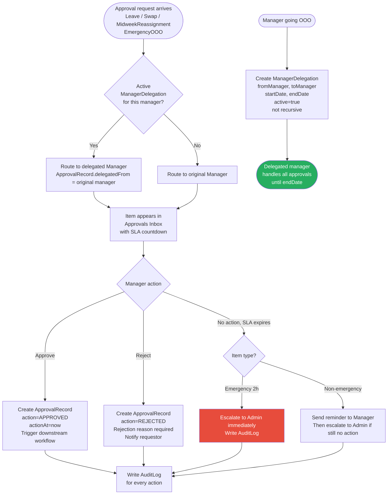
```mermaid
flowchart TD
    Request([Approval request arrives\nLeave / Swap / MidweekReassignment\nEmergencyOOO]) --> CheckDelegation{Active\nManagerDelegation\nfor this manager?}
    CheckDelegation -- Yes --> RouteDelegate[Route to delegated Manager\nApprovalRecord.delegatedFrom = original manager]
    CheckDelegation -- No --> RouteOriginal[Route to original Manager]

    RouteDelegate & RouteOriginal --> InboxItem[Item appears in\nApprovals Inbox\nwith SLA countdown]

    InboxItem --> ManagerAction{Manager action}
    ManagerAction -- Approve --> ApproveFlow[Create ApprovalRecord\naction=APPROVED\nactionAt=now\nTrigger downstream workflow]
    ManagerAction -- Reject --> RejectFlow[Create ApprovalRecord\naction=REJECTED\nRejection reason required\nNotify requestor]
    ManagerAction -- No action, SLA expires --> ExpiredFlow

    ExpiredFlow{Item type?}
    ExpiredFlow -- Emergency 2h --> ImmediateEscalate[Escalate to Admin immediately\nWrite AuditLog]
    ExpiredFlow -- Non-emergency --> ReminderThenEscalate[Send reminder to Manager\nThen escalate to Admin if still no action]

    ApproveFlow & RejectFlow & ImmediateEscalate & ReminderThenEscalate --> AuditEntry[Write AuditLog\nfor every action]

    Delegation([Manager going OOO]) --> CreateDelegation[Create ManagerDelegation\nfromManager, toManager\nstartDate, endDate\nactive=true\nnot recursive]
    CreateDelegation --> DelegationActive([Delegated manager\nhandles all approvals\nuntil endDate])

    style ImmediateEscalate fill:#e74c3c,color:#fff
    style DelegationActive fill:#27ae60,color:#fff
```

---

## 15. Holiday Impact Flow

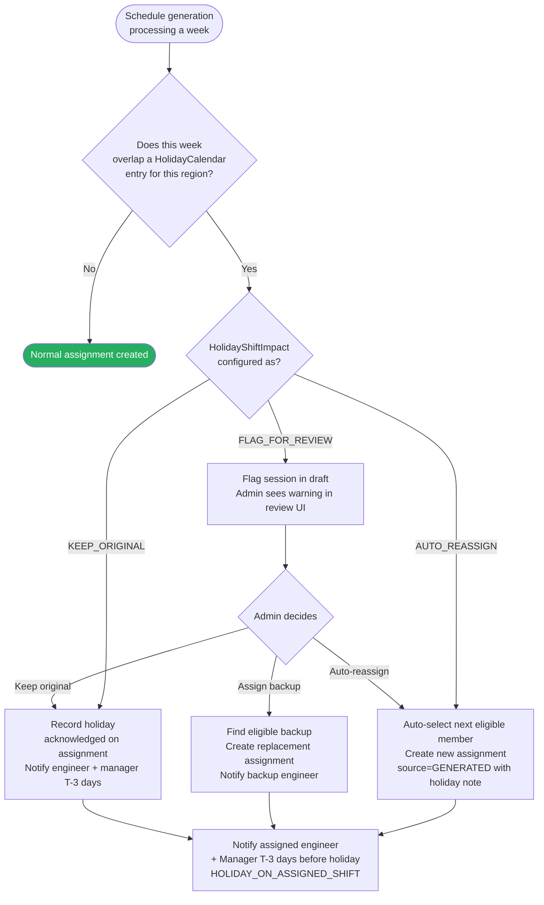
```mermaid
flowchart TD
    ScheduleGen([Schedule generation\nprocessing a week]) --> HolidayLookup{Does this week\noverlap a HolidayCalendar\nentry for this region?}
    HolidayLookup -- No --> NormalSchedule([Normal assignment created])
    HolidayLookup -- Yes --> CheckImpact{HolidayShiftImpact\nconfigured as?}

    CheckImpact -- FLAG_FOR_REVIEW --> FlagSession[Flag session in draft\nAdmin sees warning in review UI]
    FlagSession --> AdminDecides{Admin decides}
    AdminDecides -- Keep original --> KeepNote[Record holiday\nacknowledged on assignment\nNotify engineer + manager T-3 days]
    AdminDecides -- Assign backup --> AssignBackup[Find eligible backup\nCreate replacement assignment\nNotify backup engineer]
    AdminDecides -- Auto-reassign --> AutoReassign

    CheckImpact -- KEEP_ORIGINAL --> KeepNote
    CheckImpact -- AUTO_REASSIGN --> AutoReassign[Auto-select next eligible member\nCreate new assignment\nsource=GENERATED with holiday note]

    KeepNote & AssignBackup & AutoReassign --> HolidayNotification[Notify assigned engineer\n+ Manager T-3 days before holiday\nHOLIDAY_ON_ASSIGNED_SHIFT]

    style NormalSchedule fill:#27ae60,color:#fff
```

---

## 16. Notification & Reminder Flow

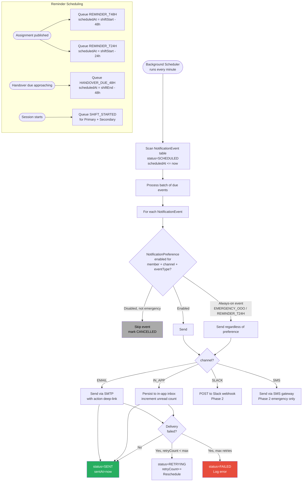
```mermaid
flowchart TD
    BackgroundJob([Background Scheduler\nruns every minute]) --> ScanQueue[Scan NotificationEvent table\nstatus=SCHEDULED\nscheduledAt <= now]

    ScanQueue --> ProcessBatch[Process batch of due events]
    ProcessBatch --> ForEachEvent[For each NotificationEvent]

    ForEachEvent --> CheckPref{NotificationPreference\nenabled for\nmember + channel + eventType?}
    CheckPref -- Disabled, not emergency --> Skip[Skip event\nmark CANCELLED]
    CheckPref -- Always-on event\nEMERGENCY_OOO / REMINDER_T24H --> SendAnyway[Send regardless of preference]
    CheckPref -- Enabled --> Send

    Send & SendAnyway --> ChannelRoute{channel?}
    ChannelRoute -- EMAIL --> SendEmail[Send via SMTP\nwith action deep-link]
    ChannelRoute -- IN_APP --> PushInApp[Persist to in-app inbox\nincrement unread count]
    ChannelRoute -- SLACK --> SlackWebhook[POST to Slack webhook\nPhase 2]
    ChannelRoute -- SMS --> SendSMS[Send via SMS gateway\nPhase 2 emergency only]

    SendEmail & PushInApp --> MarkSent[status=SENT\nsentAt=now]
    SendEmail & PushInApp --> OnFailure{Delivery\nfailed?}
    OnFailure -- Yes, retryCount < max --> Retry[status=RETRYING\nretryCount++\nReschedule]
    OnFailure -- Yes, max retries --> MarkFailed[status=FAILED\nLog error]
    OnFailure -- No --> MarkSent

    subgraph Reminder Scheduling
        AssignPublished([Assignment published]) --> QueueT48[Queue REMINDER_T48H\nscheduledAt = shiftStart - 48h]
        AssignPublished --> QueueT24[Queue REMINDER_T24H\nscheduledAt = shiftStart - 24h]
        HandoverDue([Handover due approaching]) --> QueueHandover48[Queue HANDOVER_DUE_48H\nscheduledAt = shiftEnd - 48h]
        SessionStart([Session starts]) --> QueueShiftStarted[Queue SHIFT_STARTED\nfor Primary + Secondary]
    end

    style Skip fill:#aaa,color:#000
    style MarkFailed fill:#e74c3c,color:#fff
    style MarkSent fill:#27ae60,color:#fff
```

---

## 17. Audit Log Flow

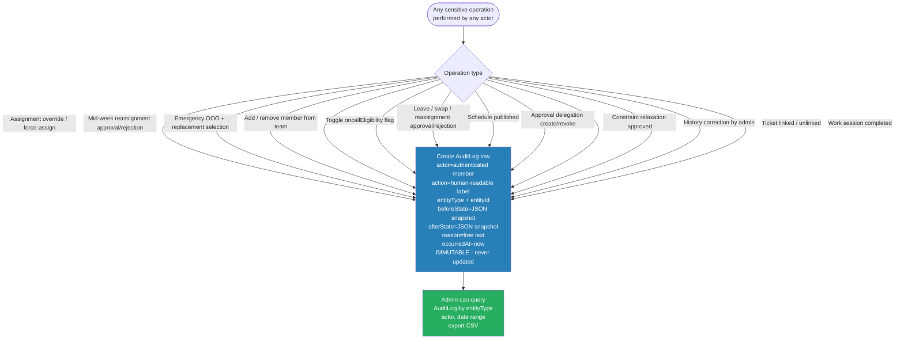
```mermaid
flowchart TD
    SensitiveOp([Any sensitive operation\nperformed by any actor]) --> OpType{Operation type}

    OpType -- Assignment override / force-assign --> WriteAudit
    OpType -- Mid-week reassignment approval/rejection --> WriteAudit
    OpType -- Emergency OOO + replacement selection --> WriteAudit
    OpType -- Add / remove member from team --> WriteAudit
    OpType -- Toggle oncallEligibility flag --> WriteAudit
    OpType -- Leave / swap / reassignment approval/rejection --> WriteAudit
    OpType -- Schedule published --> WriteAudit
    OpType -- Approval delegation create/revoke --> WriteAudit
    OpType -- Constraint relaxation approved --> WriteAudit
    OpType -- History correction by admin --> WriteAudit
    OpType -- Ticket linked / unlinked --> WriteAudit
    OpType -- Work session completed --> WriteAudit

    WriteAudit[Create AuditLog row\nactor=authenticated member\naction=human-readable label\nentityType + entityId\nbeforeState=JSON snapshot\nafterState=JSON snapshot\nreason=free text\noccurredAt=now\nIMMUTABLE - never updated]

    WriteAudit --> AdminView[Admin can query\nAuditLog by entityType\nactor, date range\nexport CSV]

    style WriteAudit fill:#2980b9,color:#fff
    style AdminView fill:#27ae60,color:#fff
```

---

## 18. Reporting Flow

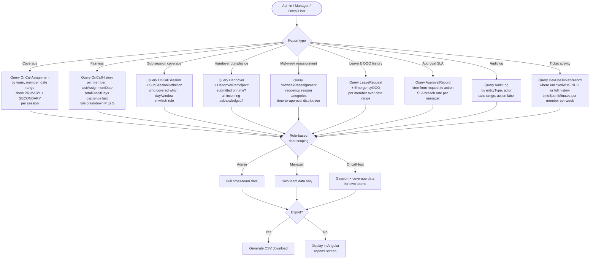
```mermaid
flowchart TD
    User([Admin / Manager / OncallHost]) --> ChooseReport{Report type}

    ChooseReport -- Coverage --> CoverageReport[Query OnCallAssignment\nby team, member, date range\nshow PRIMARY + SECONDARY\nper session]
    ChooseReport -- Fairness --> FairnessReport[Query OnCallHistory\nper member: lastAssignmentDate\ntotalCreditDays\ngap since last\nrole breakdown P vs S]
    ChooseReport -- Sub-session coverage --> SubReport[Query OnCallSession\n+ SubSessionDefinition\nwho covered which day/window\nin which role]
    ChooseReport -- Handover compliance --> HandoverReport[Query Handover\n+ HandoverParticipant\nsubmitted on time?\nall incoming acknowledged?]
    ChooseReport -- Mid-week reassignment --> ReassignReport[Query MidweekReassignment\nfrequency, reason categories\ntime-to-approval distribution]
    ChooseReport -- Leave & OOO history --> LeaveReport[Query LeaveRequest\n+ EmergencyOOO\nper member over date range]
    ChooseReport -- Approval SLA --> SLAReport[Query ApprovalRecord\ntime from request to action\nSLA breach rate per manager]
    ChooseReport -- Audit log --> AuditReport[Query AuditLog\nby entityType, actor\ndate range, action label]
    ChooseReport -- Ticket activity --> TicketReport[Query DevOpsTicketRecord\nwhere unlinkedAt IS NULL\nor full history\ntimeSpentMinutes per member per week]

    CoverageReport & FairnessReport & SubReport & HandoverReport & ReassignReport & LeaveReport & SLAReport & AuditReport & TicketReport --> ScopeFilter{Role-based\ndata scoping}

    ScopeFilter -- Admin --> FullData[Full cross-team data]
    ScopeFilter -- Manager --> TeamData[Own team data only]
    ScopeFilter -- OncallHost --> SessionData[Session + coverage data\nfor own teams]

    FullData & TeamData & SessionData --> Export{Export?}
    Export -- Yes --> CSVExport[Generate CSV download]
    Export -- No --> DisplayUI[Display in Angular\nreports screen]
```

---

## 19. Entity Relationship Overview

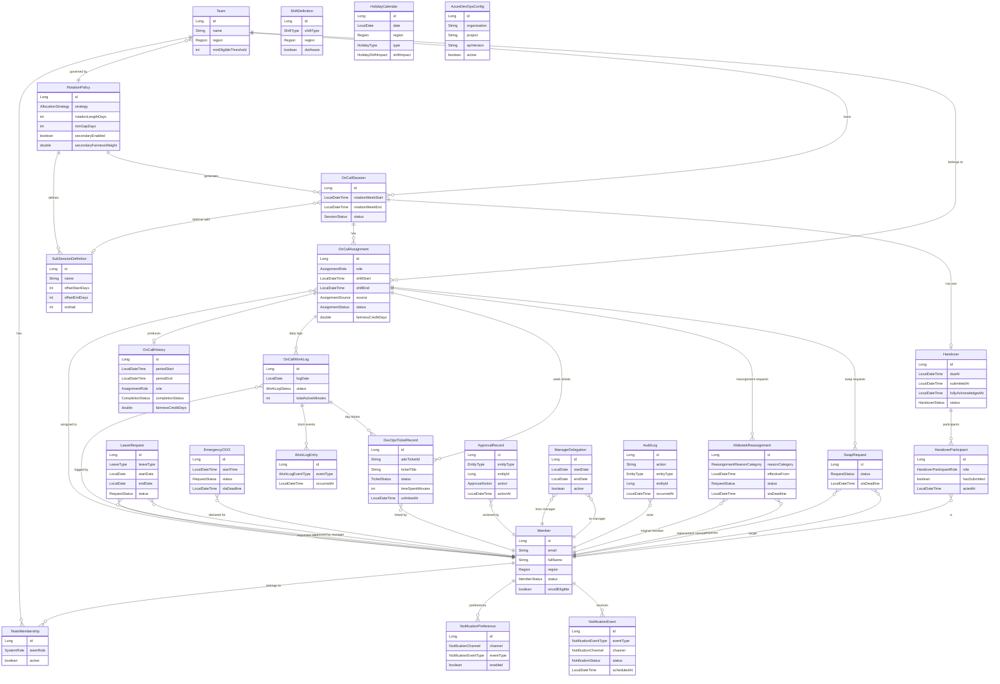
```mermaid
erDiagram
    Member {
        Long id
        String email
        String fullName
        Region region
        MemberStatus status
        boolean oncallEligible
    }
    Team {
        Long id
        String name
        Region region
        int minEligibleThreshold
    }
    TeamMembership {
        Long id
        SystemRole teamRole
        boolean active
    }
    RotationPolicy {
        Long id
        AllocationStrategy strategy
        int rotationLengthDays
        int minGapDays
        boolean secondaryEnabled
        double secondaryFairnessWeight
    }
    SubSessionDefinition {
        Long id
        String name
        int offsetStartDays
        int offsetEndDays
        int ordinal
    }
    ShiftDefinition {
        Long id
        ShiftType shiftType
        Region region
        boolean dstAware
    }
    OnCallSession {
        Long id
        LocalDateTime rotationWeekStart
        LocalDateTime rotationWeekEnd
        SessionStatus status
    }
    OnCallAssignment {
        Long id
        AssignmentRole role
        LocalDateTime shiftStart
        LocalDateTime shiftEnd
        AssignmentSource source
        AssignmentStatus status
        double fairnessCreditDays
    }
    OnCallHistory {
        Long id
        LocalDateTime periodStart
        LocalDateTime periodEnd
        AssignmentRole role
        CompletionStatus completionStatus
        double fairnessCreditDays
    }
    OnCallWorkLog {
        Long id
        LocalDate logDate
        WorkLogStatus status
        int totalActiveMinutes
    }
    WorkLogEntry {
        Long id
        WorkLogEventType eventType
        LocalDateTime occurredAt
    }
    DevOpsTicketRecord {
        Long id
        String adoTicketId
        String ticketTitle
        TicketStatus status
        int timeSpentMinutes
        LocalDateTime unlinkedAt
    }
    Handover {
        Long id
        LocalDateTime dueAt
        LocalDateTime submittedAt
        LocalDateTime fullyAcknowledgedAt
        HandoverStatus status
    }
    HandoverParticipant {
        Long id
        HandoverParticipantRole role
        boolean hasSubmitted
        LocalDateTime actedAt
    }
    LeaveRequest {
        Long id
        LeaveType leaveType
        LocalDate startDate
        LocalDate endDate
        RequestStatus status
    }
    EmergencyOOO {
        Long id
        LocalDateTime startTime
        RequestStatus status
        LocalDateTime slaDeadline
    }
    MidweekReassignment {
        Long id
        ReassignmentReasonCategory reasonCategory
        LocalDateTime effectiveFrom
        RequestStatus status
        LocalDateTime slaDeadline
    }
    SwapRequest {
        Long id
        RequestStatus status
        LocalDateTime slaDeadline
    }
    ApprovalRecord {
        Long id
        EntityType entityType
        Long entityId
        ApprovalAction action
        LocalDateTime actionAt
    }
    ManagerDelegation {
        Long id
        LocalDate startDate
        LocalDate endDate
        boolean active
    }
    HolidayCalendar {
        Long id
        LocalDate date
        Region region
        HolidayType type
        HolidayShiftImpact shiftImpact
    }
    NotificationPreference {
        Long id
        NotificationChannel channel
        NotificationEventType eventType
        boolean enabled
    }
    NotificationEvent {
        Long id
        NotificationEventType eventType
        NotificationChannel channel
        NotificationStatus status
        LocalDateTime scheduledAt
    }
    AuditLog {
        Long id
        String action
        EntityType entityType
        Long entityId
        LocalDateTime occurredAt
    }
    AzureDevOpsConfig {
        Long id
        String organization
        String project
        String apiVersion
        boolean active
    }

    Member ||--o{ TeamMembership : "belongs to"
    Team ||--o{ TeamMembership : "has"
    Team }o--|| RotationPolicy : "governed by"
    RotationPolicy ||--o{ SubSessionDefinition : "defines"
    RotationPolicy ||--o{ OnCallSession : "generates"
    Team ||--o{ OnCallSession : "hosts"
    OnCallSession }o--o| SubSessionDefinition : "optional split"
    OnCallSession ||--o{ OnCallAssignment : "has"
    OnCallSession ||--o| Handover : "has one"
    OnCallAssignment }o--|| Member : "assigned to"
    OnCallAssignment }o--|| Team : "belongs to"
    OnCallAssignment ||--o| OnCallHistory : "produces"
    OnCallAssignment ||--o{ OnCallWorkLog : "daily logs"
    OnCallAssignment ||--o{ DevOpsTicketRecord : "week tickets"
    OnCallAssignment ||--o{ MidweekReassignment : "reassignment requests"
    OnCallAssignment ||--o{ SwapRequest : "swap requests"
    OnCallWorkLog }o--|| Member : "logged by"
    OnCallWorkLog ||--o{ WorkLogEntry : "clock events"
    OnCallWorkLog ||--o{ DevOpsTicketRecord : "day tickets"
    DevOpsTicketRecord }o--|| Member : "linked by"
    Handover ||--o{ HandoverParticipant : "participants"
    HandoverParticipant }o--|| Member : "is"
    LeaveRequest }o--|| Member : "requested by"
    LeaveRequest }o--|| Member : "approved by manager"
    EmergencyOOO }o--|| Member : "declared for"
    MidweekReassignment }o--|| Member : "original member"
    MidweekReassignment }o--|| Member : "replacement member"
    SwapRequest }o--|| Member : "requestor"
    SwapRequest }o--|| Member : "target"
    ApprovalRecord }o--|| Member : "actioned by"
    ManagerDelegation }o--|| Member : "from manager"
    ManagerDelegation }o--|| Member : "to manager"
    Member ||--o{ NotificationPreference : "preferences"
    Member ||--o{ NotificationEvent : "receives"
    AuditLog }o--|| Member : "actor"
```

---

## 20. Environment & Configuration

### Required Environment Variables

| Variable | Description | Example |
|---|---|---|
| `AZDO_ORG` | Azure DevOps organisation name | `Agilysys-Inc` |
| `AZDO_PROJECT` | Azure DevOps project name | `MyProject` |
| `AZDO_TEAM` | Azure DevOps team (optional) | `MyTeam` |
| `AZDO_PAT` | Personal Access Token — encoded as `Base64(:<PAT>)` for `Authorization: Basic` | `abc123...` |
| `AZDO_API_VERSION` | ADO REST API version | `7.1-preview.3` |
| `DB_URL` | PostgreSQL JDBC URL | `jdbc:postgresql://localhost:5432/oncall` |
| `DB_USERNAME` | Database username | `oncall_user` |
| `DB_PASSWORD` | Database password | *(secret)* |
| `JWT_SECRET` | JWT signing key | *(secret)* |
| `OAUTH2_TENANT` | Azure AD / Okta tenant ID for SSO | `agilysys.com` |
| `EMAIL_SMTP_HOST` | SMTP host for email notifications | `smtp.office365.com` |
| `EMAIL_SMTP_PORT` | SMTP port | `587` |

### ADO Authentication Pattern (from `Agilysys-Inc/tracker`)

```
Authorization: Basic Base64(:<PAT>)
Base URL:       https://dev.azure.com/{AZDO_ORG}
api-version:    {AZDO_API_VERSION}   (all requests)
```

### ADO Work Item Fields Stored per Ticket

```
System.Id                              → ado_ticket_id
System.Title                           → ticket_title
System.State                           → ado_state
System.WorkItemType                    → work_item_type
System.AssignedTo (displayName)        → ado_assigned_to
System.AreaPath                        → area_path
System.IterationPath                   → iteration_path
System.Tags                            → ado_tags
System.Description (HTML stripped)     → description
System.CreatedDate                     → ado_created_date
System.ChangedDate                     → ado_changed_date
Microsoft.VSTS.Common.Priority         → priority
Microsoft.VSTS.Common.Severity         → severity
Microsoft.VSTS.Scheduling.TargetDate   → target_date
Microsoft.VSTS.Scheduling.DueDate      → due_date
```

### Email Domain Policy

All member accounts — including guest sign-ins — **must** use an `@agilysys.com` email address.
Enforced at three layers:

1. **Bean Validation** — `@Pattern(regexp = "^[a-zA-Z0-9._%+\\-]+@agilysys\\.com$")` on `Member.email`
2. **SSO / OAuth2** — identity provider configured to allow only the `agilysys.com` tenant
3. **Guest sign-in filter** — Spring Security filter rejects any token or form submission with a non-`agilysys.com` domain before a session is issued (`HTTP 403`)

---

*Generated from the on-call platform domain model — Java Spring Boot backend, Angular frontend.*
